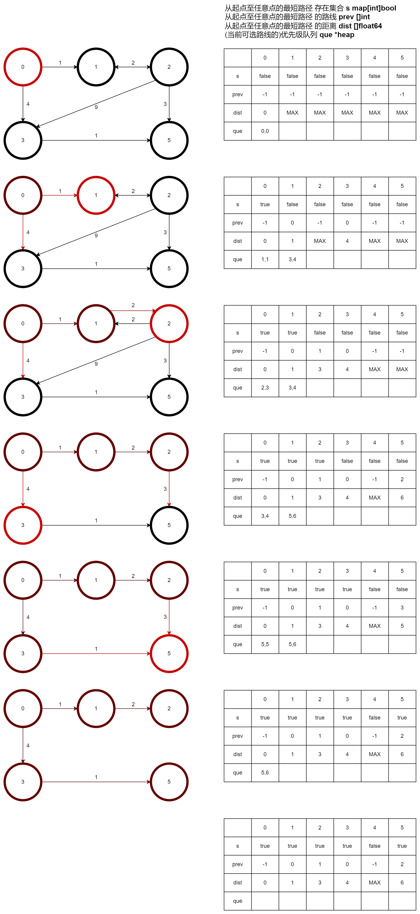

# dijkstra
dijkstra算法实现最短路径计算

实现sdk用于将各种数据模型转换为图，再求最短路径的dijkstra算法。

dijkstra是一种单源最短路算法，时间复杂度n^2，可被看作动态规划算法的一种，不过其状态转移变量有4个。

实现思路是每次选择一条距离起点sv最近的路线前进，并在将vi(遍历中的节点)纳入s时，通过此vi对其他vj(s=true的节点)松弛(如在3纳入最短路径集合后0125被松弛为035)，以此方式不断的获取起点至任意点的最短路径。

下图为算法具体实例：找出0至任意点的最短路径，其中节点4不与任何点连通所以不表示。
暗红节点/箭头表示已经获得最短路线的节点/路线；红色节点表示本次遍历中求得最短路线的节点，红色箭头表示本次遍历中que队列中的可选线路；箭头消失表示松弛过程中有比该路线更短的路线因此丢弃的路线；当que为空时循环结束。

